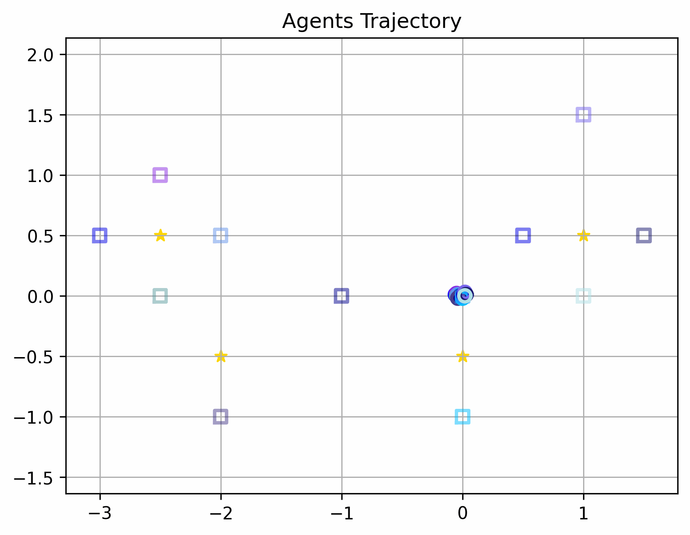
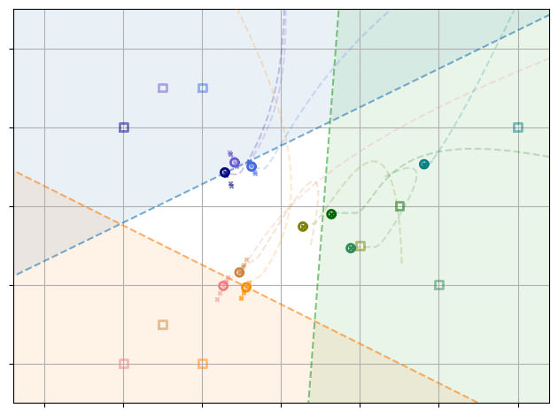
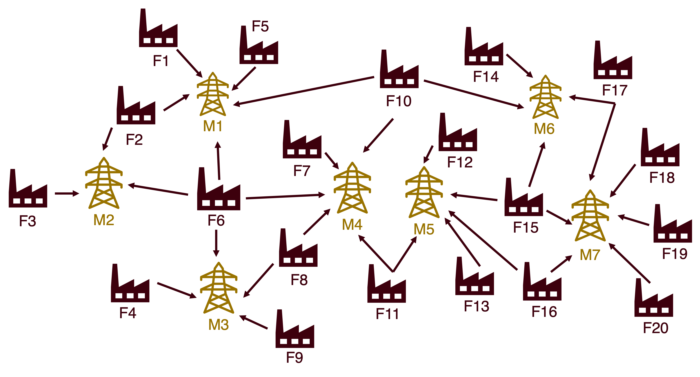

# Multi-Agent Game Problems

## 🔎 Introduction
This repository contains simulation code for our research works:

- **CDC Paper**: *A DAG-Based Analysis of Fully Distributed Algorithms for Quadratic Generalized Nash Equilibrium Problems Without Consensus*  
- **ACC Paper**: *Fully Distributed Generalized Nash Equilibrium Algorithms for Multi-Robot Placement without Consensus on Multipliers*  

The implemented problems illustrate the effectiveness of distributed GNE algorithms in robotics and economic applications, showing how agents can coordinate decisions under shared constraints without requiring multiplier consensus.

---

## Multi-Robot Problems

### 1. Robots Placement Problem
In the **Multi-Robots Placement Problem**, multiple agents (robots) act as simple integrators, collaborating to complete shared tasks.  

- Each robot is assigned to one or more tasks.  
- Tasks have central locations, and the placement of all robots assigned to a task must collectively center at its target.  
- Each robot has an **individual anchor point** (charging station or control center) and must remain within a bounded distance of it.  
- The objective function balances two goals:  
  1. Staying close to its anchor point.  
  2. Staying close to other robots handling the same tasks.  

Each agent’s cost function includes a private penalty term to trade off between these goals.  

  

---

### 2. Robots Covering Problem
In the **Robots Covering Problem**, each agent tracks its target while staying close to others for communication.  

- The individual cost for agent \(v\) is:  

  $$
  f_v(z_v, z_{-v}) = \| z_v - T_v \|^2 + \rho_v \sum_{u \neq v} \| z_v - z_u \|^2
  $$

- The space is partitioned into half-spaces, and to ensure coverage, the **group center must remain on the same side of the boundary** as the service region.  

  

---

## Cournot Competition Problem

In the **Cournot Competition Problem**, \(N\) agents produce different types of energy for a market.  

- Each agent decides how much energy to produce.  
- There are **shared equality constraints** on total market demand.  
- The objective for each agent is to minimize its cost:   

  $$
  f_v(z_v, z_{-v}) = c_v(z_v) - r_v(z_v, z_{-v})
  $$

  where \(c_v\) is the production cost and $r_v$ is the revenue.  

The game leads to a **Generalized Nash Equilibrium (GNE)** where production levels satisfy both individual constraints and market-wide equality constraints.  

  

---

## 🛠️ Structure
- `figures/` → contains images and gifs used in this README.  
- `src/` → algorithms and simulation code.  
- `docs/` → extended explanations and proofs.  

---

* robotics_planing.ipynb: This file contains the setup and generated figures for the multi-robot placement problem, including examples for the 3-agent, 1-center game and the 12-agent, 4-center game.

* CournotCompetition.ipynb: Contains the setup and generated figures for the Cournot Game, including the 3-agent, 2-market game, and the 20-agent, 7-market game.

* HarkerGame.ipynb: Contains the setup and figures for the two-agent game adapted from Harker's paper. It also includes a comparison of the existing consensus algorithm and Algorithm 1.

* Harker_matlab_visualize.ipynb: Contains the implementation of the two-agent Harker's game in MATLAB, including the existing consensus algorithm and Algorithm 1. The figures for Harker's game in the paper are all simulated in MATLAB. The code is in the HarkerGame_matlab folder.

* All random seeds are fixed and set in the code.